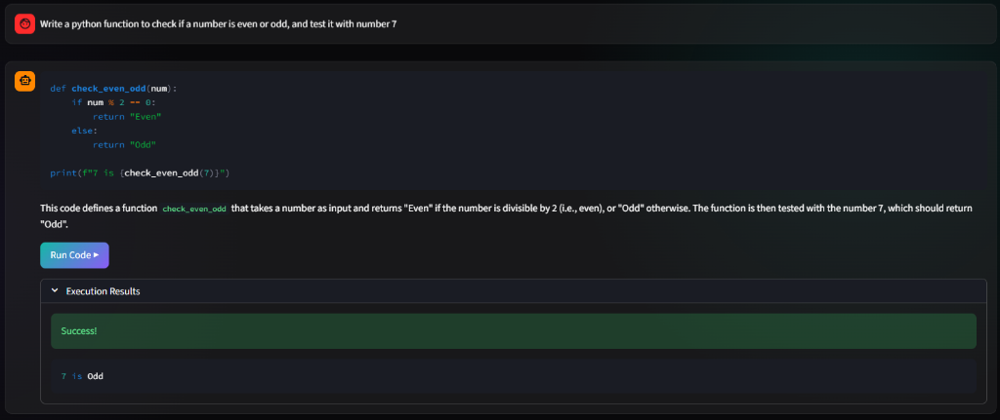
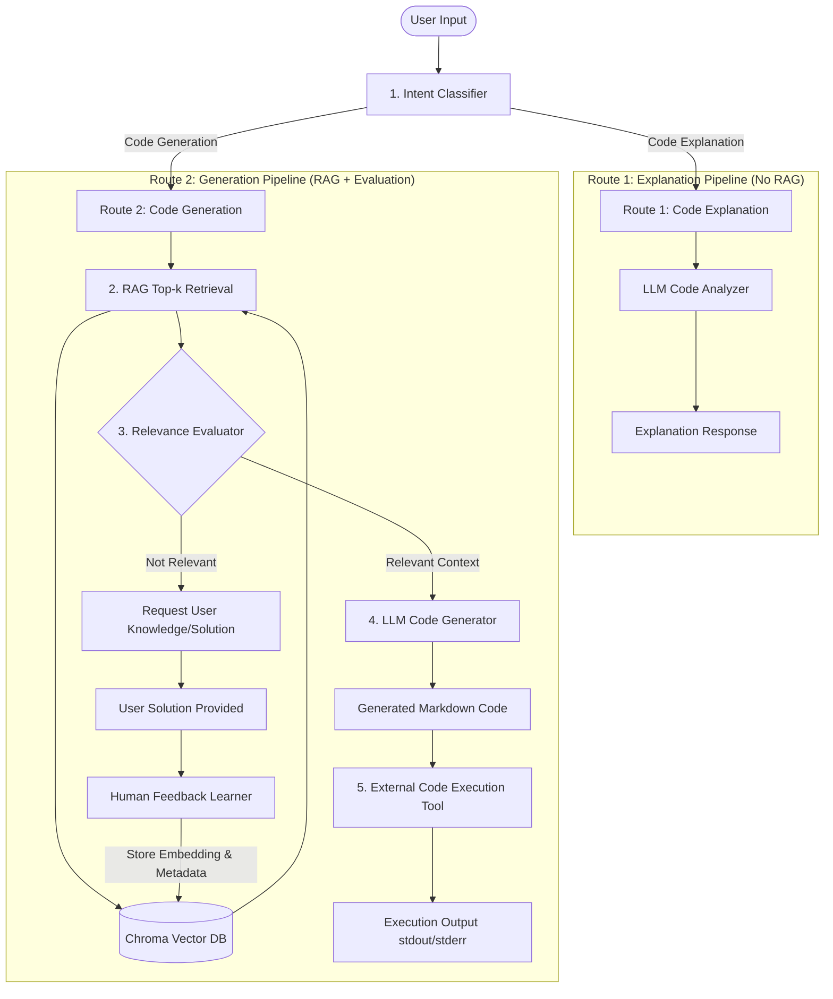

# Cellula — Intelligent AI Coding Assistant


**Cellula** is a state-of-the-art Intelligent AI Coding Assistant designed to analyze, explain, generate, execute, and continuously improve code generation using Retrieval-Augmented Generation (RAG) backed by a Chroma Vector Database.

Unlike traditional static AI assistants, Cellula dynamically routes incoming queries based on intent classification, verifies knowledge relevance before generation to prevent hallucinations, maintains long-term conversation memory, executes code in a controlled environment, and learns continuously from human feedback.



---

## 🏗 Architecture Overview

Cellula employs an intelligent dual-pipeline architecture. Queries are classified upon receipt and routed to either a lightweight direct explanation pipeline (no retrieval overhead) or a full RAG-driven code generation pipeline with relevance checks and feedback loops.



---

## ✨ Features

Cellula fulfills 10 core functional requirements designed for production-grade coding assistance:

1. **Interactive Streamlit User Interface**: Seamless web interface supporting real-time chat, conversation history, file attachments, response streaming, code block syntax highlighting, and execution triggers.
2. **LLM-Based Query Intent Classification**: Automatically categorizes user prompts into **Code Explanation** or **Code Generation** to optimize processing cost and pipeline execution.
3. **Dynamic Intelligent Router**: Directs requests to the exact processing workflow required by the query intent.
4. **Retrieval-Augmented Generation (RAG)**: Extracts top-$k$ relevant programming documents, code snippets, and framework guides via vector embeddings.
5. **Chroma Vector Database Integration**: Persistent storage for indexed codebase documentation, embeddings, and rich metadata.
6. **Retrieval Relevance Check Evaluator**: A dedicated LLM gatekeeper that validates retrieved context relevance before generation to eliminate hallucinations.
7. **Human Feedback Learning Loop**: Enables the assistant to accept user-provided solutions when context retrieval fails, automatically embedding and storing them in ChromaDB for future queries.
8. **Long-Term Conversation Memory**: Tracks conversation history, code snippets, framework preferences, and language constraints across user sessions.
9. **Production-Ready Code Generation**: Generates well-commented, modular code formatted in standard Markdown code blocks complete with error handling and docstrings.
10. **Controlled Code Execution Environment**: Safely runs generated Python scripts using an isolated execution tool, capturing standard output (`stdout`) and errors (`stderr`).

---

## 📁 Project Structure

```text
Cellula Project/
├── src/
│   ├── __init__.py
│   ├── vector_store.py
│   ├── cellula_core.py
│   └── app.py
├── notebooks/
│   └── Cellula_AI_Coding_Assistant.ipynb
├── scripts/
│   └── cellula_ai_coding_assistant.py
├── requirements.txt
├── README.md
├── .gitignore
├── LICENSE
└── setup.py
```

---

## ⚙️ How It Works

### 1. Intent Classification & Routing
Every query submitted to Cellula passes through the **Intent Classifier**:
* **Code Explanation**: Queries asking *"What does this function do?"*, *"Why does this throw an exception?"*, or *"Explain line by line"* bypass document retrieval completely. The code is passed directly to the LLM for deep analysis, reducing latency and avoiding redundant vector search.
* **Code Generation**: Queries asking *"Write a Python script for..."* or *"Build a FastAPI endpoint"* trigger the RAG pipeline.

### 2. Retrieval-Augmented Generation (RAG) & Vector Database
For code generation requests, Cellula queries the local **ChromaDB** store using `sentence-transformers` embeddings to fetch relevant context, code patterns, and library documentation.

### 3. Relevance Evaluation & Fallback
Before sending retrieved chunks to the code generator, the **Relevance Evaluator** inspects the retrieved text:
* **Relevant**: The context is injected into the LLM prompt to generate precise code.
* **Not Relevant**: Cellula politely informs the user that no matching knowledge was found and invites them to provide a working snippet.

### 4. Human Feedback Learning
When a user provides a solution following a retrieval gap, the **Human Feedback Learner** automatically chunks the input, computes vector embeddings, generates metadata tags, and inserts the document into ChromaDB. Cellula immediately becomes smarter for subsequent queries.

### 5. Code Execution Engine
Users can click **Execute Code** on any generated Python snippet. Cellula sends the string to an external execution sandbox, capturing `stdout` (e.g., printed output, return values) and `stderr` (e.g., tracebacks), displaying the results directly in the Streamlit UI.

---

## 🚀 Installation

### Prerequisites
* Python 3.10 or higher
* Git

### Step-by-Step Setup

1. **Clone the Repository**
   ```bash
   git clone https://github.com/your-org/cellula-project.git
   cd "Cellula Project"
   ```

2. **Create and Activate a Virtual Environment**
   * **Windows (PowerShell)**:
     ```powershell
     python -m venv venv
     .\venv\Scripts\Activate.ps1
     ```
   * **Linux / macOS**:
     ```bash
     python3 -m venv venv
     source venv/bin/activate
     ```

3. **Install Dependencies**
   ```bash
   pip install --upgrade pip
   pip install -r requirements.txt
   ```

---

## 💡 Usage

1. **Set your Hugging Face API Token** (or configure your LLM backend environment variable):
   * **Windows (PowerShell)**:
     ```powershell
     $env:HF_API_TOKEN="your_huggingface_api_token_here"
     ```
   * **Linux / macOS**:
     ```bash
     export HF_API_TOKEN="your_huggingface_api_token_here"
     ```

2. **Launch the Streamlit Application**:
   ```bash
   streamlit run app.py
   ```

3. Open your browser at `http://localhost:8501` to start interacting with Cellula!

---

## 🤝 Contributing

Contributions are welcome! To contribute:

1. Fork the repository.
2. Create a feature branch: `git checkout -b feature/AmazingFeature`
3. Commit your changes: `git commit -m 'Add some AmazingFeature'`
4. Push to the branch: `git push origin feature/AmazingFeature`
5. Open a Pull Request.

Please ensure all unit tests pass and code adheres to PEP 8 standard formatting.

---

## 📄 License

Distributed under the MIT License. See `LICENSE` for more information.
